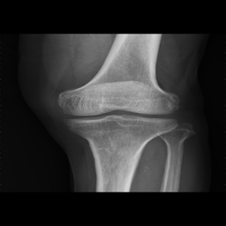
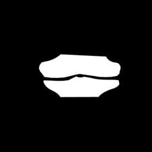
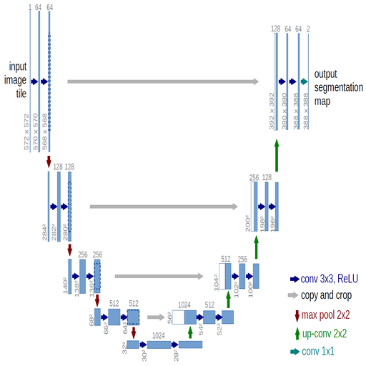
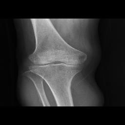
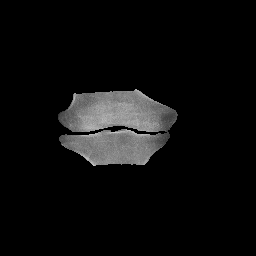

# U-net

I use TensorFlow framework to create U-net deep learning model to detect knee position in X-ray image. You can detect other parts when you provide data in data folder. 

The architecture was created by [U-Net: Convolutional Networks for Biomedical Image Segmentation](https://lmb.informatik.uni-freiburg.de/people/ronneber/u-net/).

---

## Overview

### Dataset

My dataset contain 2 types: X-ray image and its knee position as label. Here is an example of my dataset:

X-ray image            |  Label
:---------------------:|:-------------------------:
 | 

### Model Architecture




The mindset of U-net model is simple. Just like you dealing with classify dog and cat images, the output of model doing this task will be one number (the probability of cats and dogs). Now the output of U-net is 256 * 256 (the size of image) number.

### Training

U-net only take 3 epochs to get nearly 98%, but it will take a lot of time to train because we are dealing with image dataset.

### Performance

My model can remove detail that not a knee in X-ray image

Before model           |  After model
:---------------------:|:-------------------------:
 | 

---
## How to use my code

### 1. Clone it and install requirements libraries

```
git clone https://github.com/hoangcaobao/U-net.git
cd U-net
pip install -r requirements.txt
```

### 2. Upload data to train
Go to folder data, put X-rays image to image folder and put mask of its image to label folder

### 3. Train model
This step makes you wait very long but it is required to get weights of model before next step.
```
python3 training.py
```
### 4. Upload image you want U-net to detect in test folder in data folder

### 5. Use model
```
python3 test.py
```
### Now you will have output of test folder in result folder

### Thank you for reading

---
# HOANG CAO BAO


